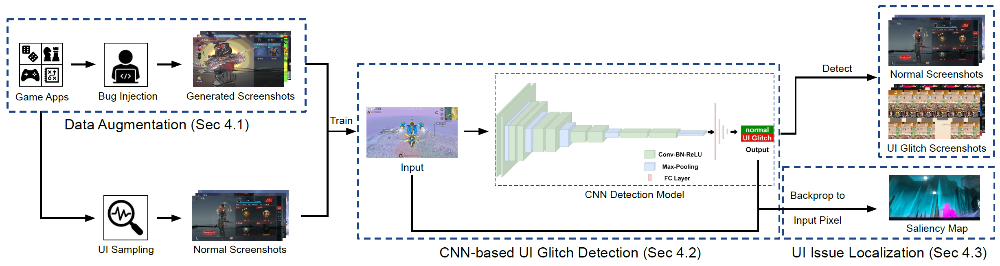
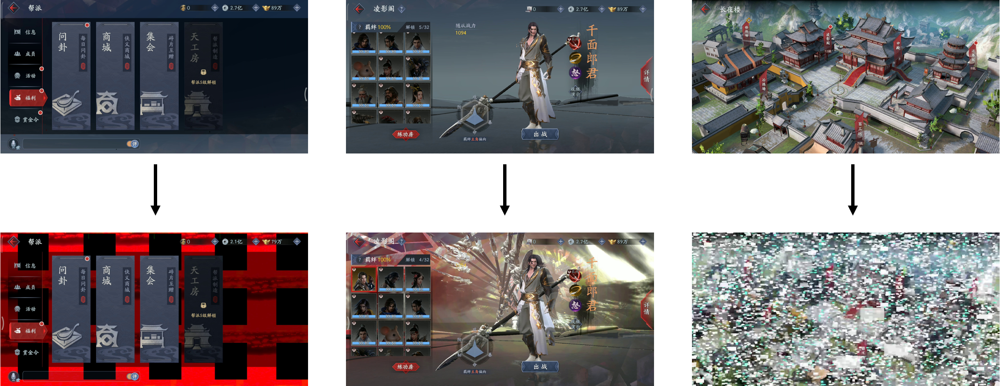
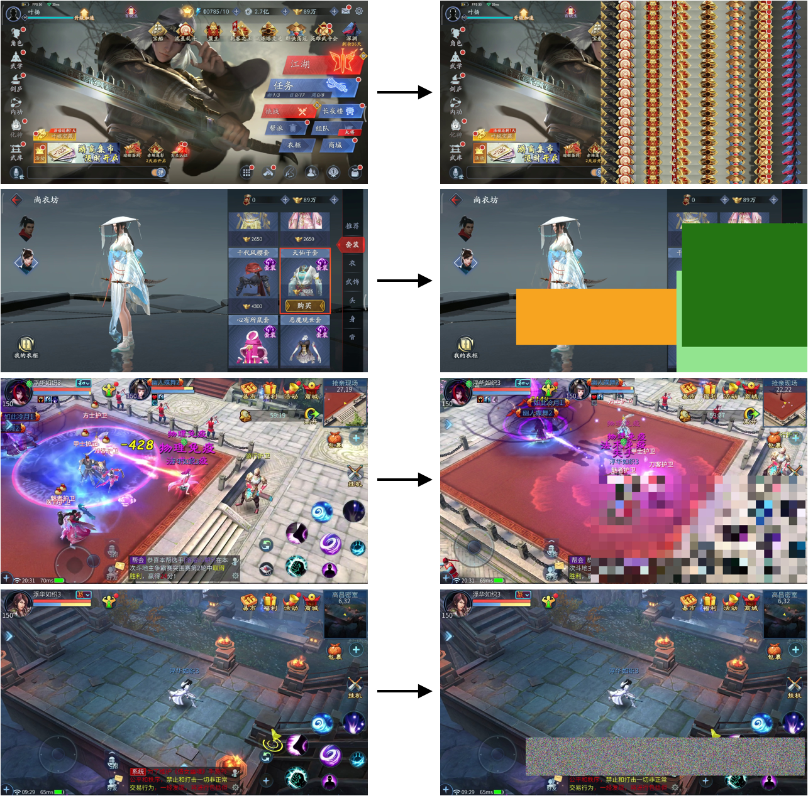
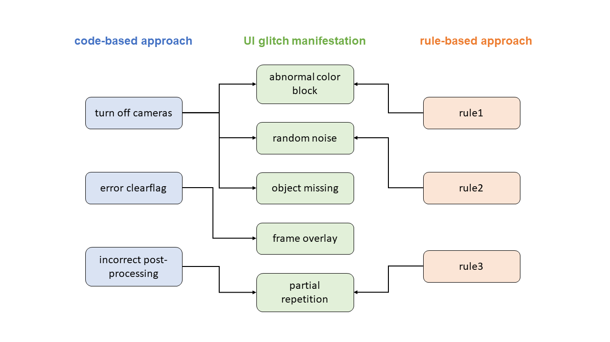
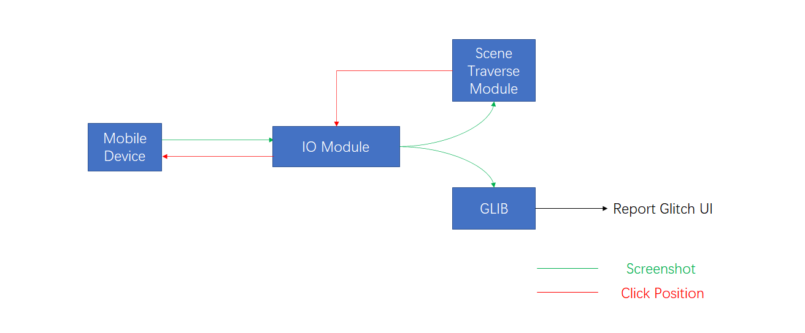

# GLIB

[](https://zenodo.org/badge/latestdoi/342098687) <br>
CNN-based visual understanding for detecting UI glitches in game Apps
> GLIB: Towards Automated Test Oracle for Graphically-Rich Applications <br>
> Paper URL: https://arxiv.org/abs/2106.10507

## Architecture



## Code-based Generation



<!-- ### Rule-based Generation:

 -->

## Requirements

On Ubuntu:

- python(3.5.2)
- pip(20.3.4)
- pytorch(0.4.0)
- [cuda](https://developer.nvidia.com/cuda-downloads?target_os=Linux&target_arch=x86_64&Distribution=Ubuntu&target_version=18.04&target_type=deb_local)
- [docker](https://docs.docker.com/engine/install/ubuntu/)
- [nvidia-docker](https://docs.nvidia.com/datacenter/cloud-native/container-toolkit/install-guide.html#docker)

Sign up a docker account from [dockerhub](https://hub.docker.com/) 

## Installation and Execution
### <span id="Download">Download dataset and model</span>: 

download the UI image [dataset](https://doi.org/10.5281/zenodo.5081242) and unzip:

```shell
unzip data.zip
```

data/images: 

- *data/images/Base* : 132 screenshots of game1 & game2 with UI display issues from 466 test reports.
- *data/images/Code* : 9,412 screenshots of game1 & game2 with UI display issues generated by our Code augmentation method.
- *data/images/Normal*: 7,750 screenshots of game1 & game2 without UI display issues collected by randomly traversing the game scene.
- *data/images/Rule(F)* : 7,750 screenshots of game1 & game2 with UI display issues generated by our Rule(F) augmentation method.
- *data/images/Rule(R)* : 7,750 screenshots of game1 & game2 with UI display issues generated by our Rule(R) augmentation method.
- *data/images/testDataSet* : 192 screenshots  with UI display issues from 466 test reports(exclude game1 & game2).

data/data_csv:

- *data/data_csv/Base* : dataset for baseline method.
- *data/data_csv/Code* : dataset for our Code Augmentation method.
- *data/data_csv/Rule(F)* : dataset for our Rule(F) Augmentation method.
- *data/data_csv/Rule(R)* : dataset for our Rule(R) Augmentation method.
- *data/data_csv/Code_plus_Rule(F)* : dataset for our Code&Rule(F) Augmentation method.
- *data/data_csv/Code_plus_Rule(R)* : dataset for our Code&Rule(R) Augmentation method.
- *data/data_csv/testDataSet* : test dataset(normal image and real glitch images from 466 test reports).

download the pre-trained [model](https://doi.org/10.5281/zenodo.5081280) and unzip:

```shell
unzip model.zip
```

- *model/Base* : pre-trained model for baseline method.
- *model/Code* : pre-trained model for our Code Augmentation method.
- *model/Rule(F)* : pre-trained model for our Rule(F) Augmentation method.
- *model/Rule(R)* : pre-trained model for our Rule(R) Augmentation method.
- *model/Code_plus_Rule(F)* : pre-trained model for our Code&Rule(F) Augmentation method.
- *model/Code_plus_Rule(R)* : pre-trained model for our Code&Rule(R) Augmentation method.

### Environment Setup

#### Method1: Very simple: pull a Docker image (Recommanded)

Step1: Login with your username and password
```shell
docker login
```
Step2: Pull source from our docker and start a container
```shell
docker pull qwertymj/glib:0.0.1
docker container run -it --gpus all qwertymj/glib:0.0.1 /bin/bash
```
Step3: Open another shell to check the running container ID
```shell
docker ps
```
Step4:  [Download dataset and model](#Download)

Step5: Copy the container ID and push our dataset to the container

```shell
docker cp data [container ID]:/code/data
docker cp model [container ID]:/code/model
cd /code
pip install -r requirements.txt -i https://pypi.tuna.tsinghua.edu.cn/simple 
```

#### Method2: A bit harder: build a Docker image
Step1: Clone repo
```shell
git clone --recursive https://github.com/GLIB-game/GLIB.git
```
Step2: Build docker image
```shell
cd GLIB
sudo docker image build -t qwertymj/glib:0.0.1 .
```
Step3: Start the container
```shell
docker container run -it --gpus all qwertymj/glib:0.0.1 /bin/bash
```
Step4: [Download dataset and model](#Download)

Step5: Copy the container ID and push our dataset to the container

```shell
docker cp data [container ID]:/code/data
docker cp model [container ID]:/code/model
cd /code
pip install -r requirements.txt -i https://pypi.tuna.tsinghua.edu.cn/simple 
```

#### Method3: Hard: set up the environment manually (Not Recommanded)

First you should make sure your linux system has installed cuda(9.0.176) and cudnn(7.4.2)

Step1: Install dependencies
```shell
apt-get update && \
apt-get install -y wget \
gnupg \
apt-transport-https \
tzdata \
net-tools \
dnsutils \
iproute2 \
gcc \
tmux \
htop \
git \
vim \
sudo \
cmake \
libgl1-mesa-glx \
libglib2.0-0 \
openssh-server
```

Step2: Build python virtual environment

```shell
conda create -n python3.5 python=3.5.2
conda activate python3.5
```

Step3: Clone the GLIB repository

```shell
git clone --recursive https://github.com/GLIB-game/GLIB.git
```
Step4: Install python dependencies
```shell
cd GLIB
pip install --upgrade pip
pip install -r requirements.txt -i https://pypi.tuna.tsinghua.edu.cn/simple 
```


### Train the CNN model

Training from scratch:

```shell
python train.py --train_data train_file_path --eval_data eval_file_path --augType Type
```

Example:

```shell
python train.py --train_data data/data_csv/Code/Code_train.csv --eval_data data/data_csv/Code/Code_test.csv --augType Code
```

Training from the pre-trained model:

```shell
python train.py --train_data train_file_path --eval_data eval_file_path --augType Type --model_path model_path
```

Example:

```shell
python train.py --train_data data/data_csv/Code/Code_train.csv --eval_data data/data_csv/Code/Code_test.csv --augType Code --model_path model/Code/Code.pkl
```

### Evaluate the model

```shell
python test.py --test_data test_data_path --model model_path
```

Example:

```shell
python test.py --test_data data/data_csv/testDataSet/testData_test.csv --model model/Code/Code.pkl
```

### Generate saliency map

```shell
python saliencymap.py --test_data test_data_path --model model_path
```

Example:

```shell
python saliencymap.py --test_data data/data_csv/testDataSet/testData_test.csv --model model/Code/Code.pkl
```


## Configuration

Changing hyper-parameters is possible by editing the file [config.py](https://github.com/GLIB-game/GLIB/blob/main/config.py)

#### config.EPOCH:

The max number of epochs to train the model. Stopping earlier must be done manually (kill).

#### config.TRAIN_BATCH_SIZE:

Batch size in training.

#### config.SAVE_STEP:

After how many training steps a model should be saved.

#### config.EVAL_STEP:

After how many training steps the model test its performance on evaluation dataset.

#### config.LR:

The learning rate in training.

#### config.EVAL_BATCH_SIZE

Batch size in evaluation step.

#### config.TEST_BATCH_SIZE

Batch size in test step.


## Supplementary explanation

#### The correlation between our self-defined code & rule approaches and corresponding UI glitches:


#### Reult for Practical Evaluation (RQ4)

|         |       Code        |      Rule(R)      |      Rule(F)      |
| :-----: | :---------------: | :---------------: | :---------------: |
|   PC    |         7         |         3         |         1         |
| Android |        35         |        22         |        15         |
|   iOS   |        11         |         6         |         5         |
|  total  | 53 (48 confirmed) | 31 (28 confirmed) | 21 (17 confirmed) |

#### AutoTest FrameWork



